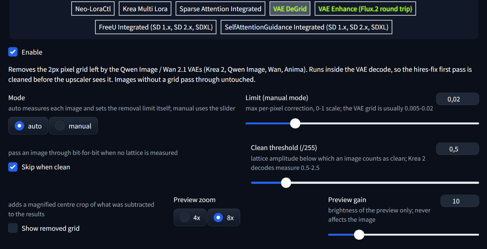
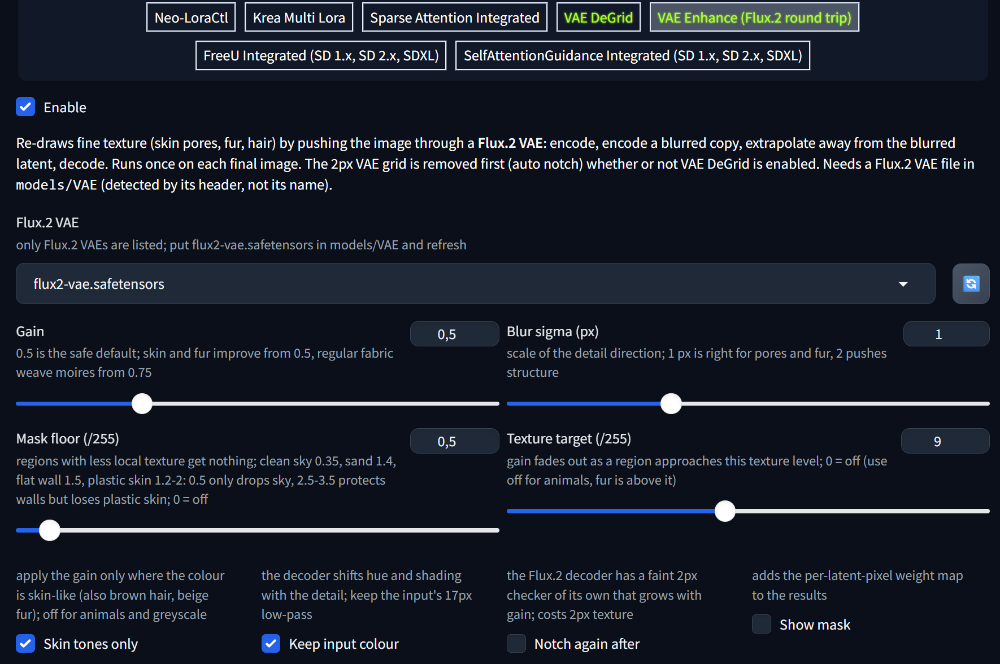
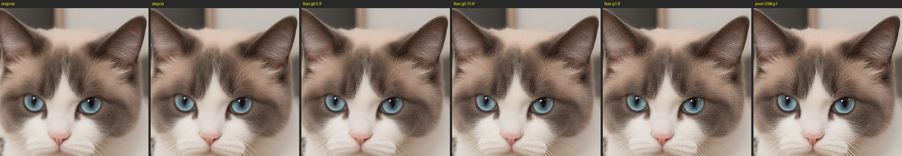
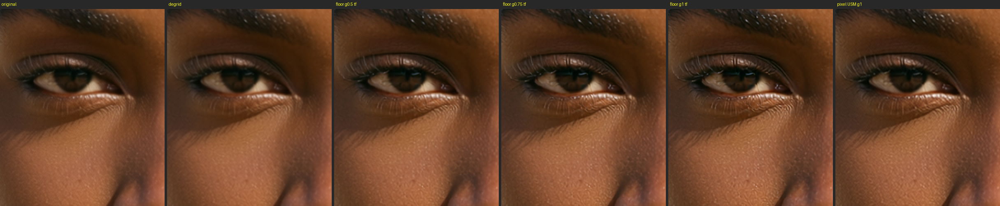
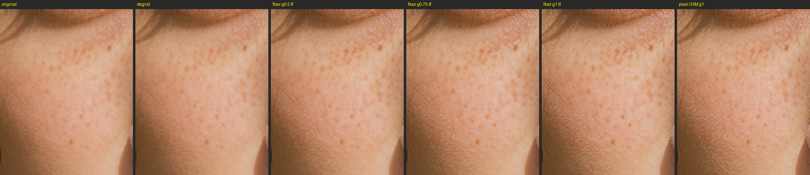
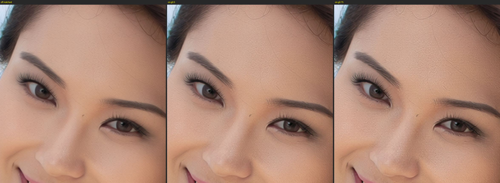
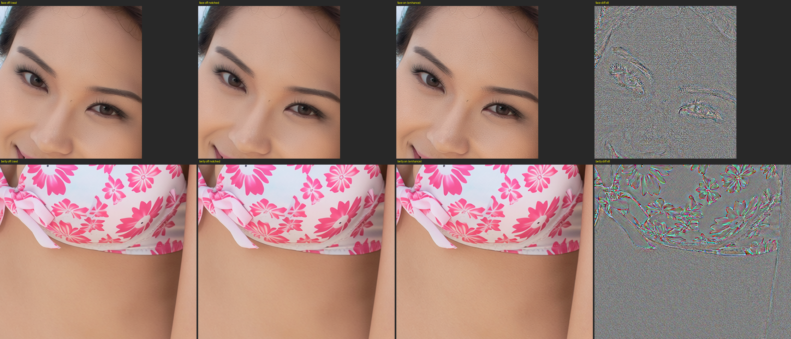
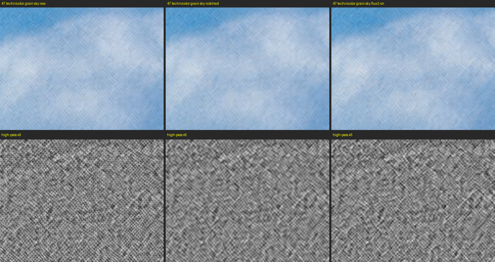

# ComfyUI-DeGrid

**VAE DeGrid (Nyquist Notch)** — a ComfyUI node and a Forge Neo extension that remove the 2px pixel grid that the
Qwen Image VAE (and, to a lesser extent, the Wan 2.1 VAE) leaves across decoded
images. Affects Krea2, Qwen Image, **Qwen Image 2.1**, Anima and anything else
built on those VAEs.

The artifact is easy to miss at 100% zoom, but it gets amplified by any
sharpening or upscaling applied afterwards. This node erases it exactly, with
auto-calibration so there is nothing to tune.

It reads worst in flat, dark areas — a lattice of fixed amplitude has the most
local contrast to sit against where the image itself is smooth.

## Front ends

One repo, one set of maths (`degrid_core.py`), several hosts:

| Host | Where it lives | Status |
|---|---|---|
| ComfyUI | `__init__.py` at the repo root (node **VAE DeGrid (Nyquist Notch)**) | shipped |
| Forge Neo | `scripts/degrid_forge.py` + `lib_degrid/` (accordion **VAE DeGrid**) | shipped, see [Forge Neo](#forge-neo) |
| SwarmUI | `DeGridExtension.cs` + `assets/` (parameter group **VAE DeGrid**) | shipped, see [SwarmUI](#swarmui) |

A second, optional tool lives in the same repo: **VAE Enhance**, which re-draws
fine texture (skin pores, fur, hair) by pushing the finished image through a
Flux.2 VAE. Same maths file for every host (`vae_enhance_core.py`), see
[VAE Enhance](#vae-enhance-flux2-round-trip).

| Host | Where it lives | Status |
|---|---|---|
| ComfyUI | node **VAE Enhance (Flux.2 round trip)** in `__init__.py` | shipped |
| Forge Neo | `scripts/vae_enhance_forge.py` + `lib_degrid/flux2_vae.py` (accordion **VAE Enhance (Flux.2 round trip)**) | shipped |
| SwarmUI | same `DeGridExtension.cs` (parameter group **VAE Enhance**) | shipped, see [SwarmUI](#swarmui) |

Cloning the repo into a host's extension folder is enough; each host only
loads its own entry point and ignores the others.

## Install (ComfyUI)

```
cd ComfyUI/custom_nodes
git clone https://github.com/lunaaispace-eng/ComfyUI-DeGrid
```

No dependencies beyond torch (no OpenGL/GLFW — works headless). Restart ComfyUI
and search for **degrid**. The notch needs nothing else; the optional
[VAE Enhance](#vae-enhance-flux2-round-trip) node needs a Flux.2 VAE file
(`flux2-vae.safetensors`, 336 MB) in `models/vae`.

> **Do not install this alongside [ComfyUI-SaveSimple](https://github.com/lunaaispace-eng/ComfyUI-SaveSimple).**
> That pack bundles the same node under the same id (`VAEDeGrid`), so having both
> installed is a node-id collision. Pick one: this repo if you only want the grid
> fix, SaveSimple if you already use the rest of that suite.

## Quick start

1. Wire **VAE Decode → VAE DeGrid → (everything else)**. It must sit *before*
   any sharpening, deconvolution, or upscaling — those amplify the grid, so
   remove it first.
2. Leave the defaults. `auto` mode measures each image and calibrates itself.
3. Run once. The node displays a status line, e.g.:

   ```
   grid 2.10/255 (checker) — removed (limit 0.019 auto) · edges protected 1.2%
   ```

   That readout is your confirmation it worked — you don't need to pixel-peep.
   On an image that has no grid you get this instead, and nothing is changed:

   ```
   grid 0.16/255 — none detected, passed through untouched · edges protected 0.0%
   ```

> **Order matters more than it looks.** Put this straight after `VAE Decode`,
> *before* any resize, and before a diffusion restorer/upscaler such as SeedVR2.
> A half-scale resize will hide the lattice from your eyes, but the restorer has
> already been handed it — and a restorer reads a regular lattice as detail worth
> reconstructing. Degridding after the upscaler is too late; the node will tell
> you there is nothing left to remove.

## Settings

| Widget | Default | What it does |
|---|---|---|
| `enabled` | on | Off = the image passes through completely untouched. Flip it for a quick A/B comparison. |
| `mode` | `auto` | **auto (recommended):** measures the grid strength and sets the removal limit itself — nothing to tune, adapts to different VAEs and content. Calibrated per 256px tile: each tile starts from a robust guess and raises its limit, in 1.5× steps up to 0.05, until the lattice left there is under half the `threshold`; the tile limits are blended into a smooth per-pixel map. A flat sky stays near 0.005 while textured ground climbs to 0.05, so regions with little grid are not clamped as hard as the regions that need it. **manual:** uses the `limit` widget everywhere instead. Only switch if auto visibly under- or over-corrects. |
| `limit` | 0.02 | **Manual mode only** (ignored in auto). Maximum per-pixel correction on the 0–1 scale. The VAE grid is usually 0.005–0.02. Too low → grid partially survives in contrasty areas. Too high → fine 2–3px texture (skin pores, fabric weave) gets slightly softened. |
| `skip_when_clean` | on | Leave the image completely untouched when no grid is actually there. The node measures the lattice directly, so anything that has already been through an upscaler or a resize is passed through **bit-for-bit**. Turn it off only to force the filter to run regardless. |
| `grid_gain` | 10 | Brightness amplification of the `removed_grid` preview **only** — never affects the cleaned image. Raise it if the preview looks like flat gray. |
| `grid_view` | `4x zoom` | Framing of the `removed_grid` preview. `full frame` shows the whole image (reads as gray noise at preview size — see below). `4x zoom` / `8x zoom` show a magnified center crop where the actual 2px lattice is visible. Preview only; the cleaned image is never cropped. |
| `threshold` | 0.5 | Optional. Lattice amplitude in /255 units below which an image counts as clean and is passed through. Native Qwen-VAE decodes measure 0.5–2.5, resized or upscaled images 0.1–0.2. Lower it (0.3) if a model you know is gridded reports `none detected`. |

RGBA images (the Qwen Image 2.1 VAE decodes to four channels) are filtered on
their colour channels only; alpha is passed through untouched and takes no part
in the measurement.

### Status line

After each run the node shows what it measured:

- **`grid X/255 (orientation)`** — the measured lattice amplitude, peak-to-peak.
  The raw Qwen-VAE grid is typically 1–5/255 (measured on Qwen Image 2.1
  decodes: 1.6–2.0/255). Below 0.5/255 the node reports **none detected** and
  passes the image through untouched. The orientation in brackets — `checker`,
  `V-stripe` or `H-stripe` — is whichever component dominates.

  This is a *phase-locked* measurement, not a percentile of the filter's own
  output. The grid's phase is tied to the VAE's output stride, so it is constant
  across the frame: averaging the four `(y%2, x%2)` sublattices keeps the grid
  while genuine detail cancels. That matters, because "how much high-frequency
  content is in this image" is not the same question as "is there a grid", and
  answering the first one gets it backwards on a busy image.
- **`limit N (auto|manual)`** — the correction cap that was applied. In auto
  mode this is a range, e.g. `limit 0.010-0.050 auto`: the lowest and highest
  tile limits in the image.
- **`partially removed, X/255 left`** — the cap was lower than the grid's own
  amplitude, so part of the lattice survived. The node measures what is left
  in the cleaned image rather than assuming the notch got it all. Raise the
  limit (or go back to `auto`).
- **`edges protected N%`** — percentage of pixels where the correction hit the
  cap. Those are real edges/detail being passed through unsoftened. A few
  percent is normal; a very high number means lots of legitimate
  high-frequency content (or a manual limit set too low).

## Reading the removed_grid preview

**"It's just gray noise — is it even doing anything?"** Yes. That is exactly
what success looks like, and here is why: the artifact is a 2-pixel pattern.
A node preview shows a 1728px image at a few hundred pixels wide, so a 2px
lattice is far below what the thumbnail can render — it aliases into uniform
gray "noise". The information is real; the zoom level just can't show it.

Two ways to actually see it:

- Set `grid_view` to `4x zoom` or `8x zoom` (default is 4x): the preview
  becomes a magnified center crop and the regular lattice pattern is plainly
  visible.
- Or open the preview image at 100%+ zoom.

What to look for:

| removed_grid shows | Meaning |
|---|---|
| Uniform fine grid / speckle, brighter over textured areas | Working correctly |
| Nearly flat gray | Little or no grid in this image (check the status line — likely `none detected`) |
| Recognizable faces, fabric, edges | Limit too high — switch to manual and lower `limit` |

A faint silhouette of the subject is normal (the artifact is slightly stronger
over detailed areas). Recognizable *detail* is not.

## Troubleshooting

| Symptom | Fix |
|---|---|
| Grid still visible in contrasty areas after filtering | `mode: manual`, raise `limit` toward 0.03–0.04 |
| Fine texture (pores, weave) looks softened | `mode: manual`, lower `limit` toward 0.01 |
| Status says `none detected` but you see a grid | The grid may be coming from a later node (sharpener, upscaler) — this node only fixes what the VAE decode produced. Check the chain order. If the image reached this node via a resize, the resize has already scrambled the lattice; move the node earlier. |
| You want it to filter anyway | Turn `skip_when_clean` off. The status line then reads `none detected, filtered anyway`. |
| removed_grid looks like flat gray | Raise `grid_gain`, or the image simply has no grid |

## Forge Neo

The same filter as a [Forge Neo](https://github.com/Haoming02/sd-webui-forge-classic/tree/neo)
extension, for the Wan-VAE models Forge Neo runs (Krea 2, Qwen Image, Wan, Anima).

```
cd <forge-neo>/extensions
git clone https://github.com/aoleg/ComfyUI-DeGrid
```

Restart the webui. A **VAE DeGrid** accordion appears on the txt2img and img2img
tabs, off by default. Tick it and generate; the console prints one line per VAE
decode, e.g.

```
DeGrid: 1536x1536 | grid 2.54/255 (V-stripe) - removed (limit 0.010 auto) | edges protected 2.9%
```

and the same verdict is written into the image's parameters as `DeGrid result`.

### Where it runs, and why that matters

In Forge the filter is not an image post-process. The extension replaces the
checkpoint's VAE, for the duration of each sampling pass, with a wrapper that
runs the notch inside every decode. Two things follow:

- **Hires fix is handled correctly.** Forge decodes the first pass and hands the
  pixels straight to the hires upscaler with no extension hook in between. An
  image-level hook would leave the grid under the upscaler, exactly the case the
  ComfyUI section above warns about. Decode-level filtering cleans the first pass
  *before* the upscaler sees it, then the final decode again. Latent-space hires
  upscalers only decode once, at the end, which is also covered.
- **Nothing else changes.** Encoding (img2img, inpainting, hires re-encode) is the
  checkpoint's own, untouched. The wrapper shares the loaded VAE weights, so
  there is no second model in memory, and tiled decoding and the out-of-memory
  fallback go through the same filter. Any extension that installs its own VAE
  subclass (e.g. an upscaling decoder) still works: its decode runs first and
  the notch runs on its output, where it will usually find nothing to remove.

A measured 2px lattice from the real Forge Neo Krea 2 decodes used to validate
this: 1.4 to 2.5/255 before, 0.05 to 0.2/255 after. The same images generated
with a Flux VAE measure 0.07 to 0.09/255 and are passed through untouched.

### Controls

| Control | Default | What it does |
|---|---|---|
| Mode | `auto` | Same as the node's `mode`: `auto` measures each image and sets the removal limit; `manual` uses the slider. |
| Limit (manual mode) | 0.02 | Same as the node's `limit`; ignored in `auto`. |
| Skip when clean | on | Same as the node's `skip_when_clean`. |
| Clean threshold (/255) | 0.5 | New in Forge: the lattice amplitude below which an image counts as clean and is left alone. Forge Neo Krea 2 decodes have measured as low as 0.47/255, just under the default, so lower it (0.3) if the console reports `none detected` on a model you know is gridded. Raise it to be more conservative. |
| Show removed grid | off | Adds a magnified centre crop of the subtracted component to the results, one per final image, so you can see the lattice without pixel-peeping. |
| Preview zoom, Preview gain | `8x`, 10 | Framing and brightness of that preview only; the cleaned image is never affected. |

Settings are saved to the image parameters as `DeGrid: mode=auto;skip=1;threshold=0.5`
(plus `limit=` in manual mode) and restore from the paste button.

### Notes

- **Order relative to other decode-side extensions.** DeGrid installs its VAE
  wrapper early (`sorting_priority = 10`), so an extension that swaps the VAE
  later, such as Neo VAE Utils, replaces the wrapper rather than being wrapped by
  it. Its decode then runs without DeGrid, which is the right outcome for an
  upscaling decoder that already averages the grid away.
- **Batches.** Each image in a batch is measured and limited on its own. The
  console line carries `[i/n]`; the parameters carry the first image's verdict.
- **Interrupted runs.** The swap is scoped to one sampling pass by Forge itself
  and is additionally undone at the end of every run and at the start of the
  next, so an interrupted generation cannot leave the wrapper installed.
- **Tests.** `python -m unittest discover -s tests -v` from the repo root, with
  any venv that has torch, numpy and Pillow. No Forge checkout or checkpoint is
  needed; the hook wiring, the decode topology (direct, tiled, OOM fallback),
  the hires double pass and the parameter round trip are all covered offline.

## Swapping the decoder instead

A recurring suggestion is to avoid the grid by not using the Qwen decoder at
all. Two versions of that idea, measured:

**A different VAE family (Flux, Flux 2) does not fit.** Krea 2, Qwen Image and
Wan read and write the 16-channel Wan latent space. Every step that samples with
one of those models must encode with the Qwen/Wan encoder and decode with a
Wan-latent decoder, so a Flux VAE can only ever be used for a pure
encode-decode round trip with no sampling in between. That round trip removes
the 2px lattice because the pattern cannot pass the bottleneck, but it also
re-synthesizes every other 2-4px detail through a different decoder. The notch
removes only the 2px band and adds nothing.

**A different decoder for the same latent space does work.** The
[Wan2.1 VAE upscale2x](https://huggingface.co/spacepxl/Wan2.1-VAE-upscale2x)
checkpoint is a decoder-only finetune whose last conv emits 12 channels, pixel-
shuffled into a 2x image (available in Forge Neo through
[Neo-VAE-Utils](https://github.com/aoleg/Neo-VAE-Utils)). Measured with the real
weights, on three 1536px inputs, lattice peak-to-peak in /255:

| input | input | 2x decode | 1x gaussian | 1x bilinear | 1x area | 1x lanczos |
|---|---|---|---|---|---|---|
| Krea 2, gridded | 2.54 | 1.30 | 0.03 | 0.04 | 0.11 | 0.06 |
| Krea 2, degridded | 0.32 | 1.22 | 0.02 | 0.03 | 0.07 | 0.05 |
| Z-Image (Flux VAE) | 0.07 | 1.06 | 0.03 | 0.04 | 0.08 | 0.06 |

- **The lattice is made by the decoder, not carried in the latent.** A grid-free
  input produces the same 2x lattice as a gridded one, and a gridded input's
  lattice does not survive the encoder. Degridding before a re-encode only
  protects whatever reads the pixels in between (an upscaler, a restorer); the
  next Qwen decode always adds a fresh grid, which is why the Forge extension
  filters every decode rather than the final image.
- **At 2x the upscale decoder is gridded too**, at about half the stock
  amplitude, vertical stripes dominant, phase-locked across the whole frame.
  Use DeGrid after it. In Forge the two extensions compose on their own.
- **Downscaled back to 1x it is clean.** Every filter leaves at most 0.11/255
  (area, a 2-tap box); gaussian and bilinear leave 0.02-0.04, and DeGrid
  reports `none detected` and passes the image through. The round trip
  reconstructs Wan-native content at 39-41 dB PSNR.

So for a plain decode the two routes reach the same place. The notch costs a
few milliseconds and covers every decode path; the upscale decoder is a full
decode at four times the pixel count, but also gives real 2x output when that
is what you want.

A Flux.2 round trip on its own is a worse grid remover than the notch (0.29/255
left against 0.05, a faint checker of its own, ~34 dB of fidelity everywhere),
so it is not offered as one. What the Flux.2 encoder *is* good for is the next
section.

## VAE Enhance (Flux.2 round trip)

### Where the idea came from

The Qwen Image VAE that Krea 2, Qwen Image and Anima decode through has two
reputations: it leaves the 2px grid this repo was written to remove, and it
renders skin as smooth plastic. The Flux.2 VAE has the opposite reputation,
fine detail and no grid. Since a VAE is just an encoder and a decoder, the
question was whether a finished image could be pushed *through* the Flux.2 VAE
as a post-process, encode then decode, and come back with its grid gone and
its skin texture re-drawn. The first answer, from the literature, was no: a
round trip is a reconstruction, the decoder reproduces whatever it is given,
and smooth skin in means smooth skin out. The second answer, from
experiments, was "not a round trip, but something close to one".

### What the research showed

Two measurements settled it. A five-VAE round trip of a real photo
([sheet](scr/research-five-vae-roundtrip.png): Flux 1, Flux 2, Qwen 1, Qwen 2.1
and Wan 2.1, eye region at 4x) confirmed that a plain round trip removes the
grid but re-writes about half of the pore texture with its own version at the
same energy, so it cannot restore anything that is not already there. It also
showed that the stock Wan 2.1 decoder has no lattice at all, so the grid is a
property of the Qwen fine-tune, not of the architecture. The operation that
does add texture is *extrapolation*: encode the image, encode a slightly
blurred copy, and decode the latent pushed away from the blurred one. The
difference between the two latents is what the encoder considers fine detail,
in the channel space where sub-8px structure actually lives, and the decoder
renders the added energy as pores and strands rather than as the edge halo and
uniform grain a pixel unsharp mask produces at the same energy. The first
ladder on a Krea 2 portrait ([sheet](scr/research-first-ladder.png): original,
round trip, gains 1 to 3, then the pixel unsharp mask at matched energy) fixed
the working range: gain 0.5 draws pores, gain 1 tints and etches, gain 2 and
above turns skin into worms and oil paint. Eight images later the defaults
below were set, and two more findings shaped the design: the grid must be
notched *before* the extrapolation, because blurring removes it and the
difference would otherwise carry it back onto every flat wall, and a fixed
gain amplifies regular fabric weave into moiré from about 0.75, which is why
0.5 is the default and not a starting point.

### What we made

An optional second tool in the same repo, on all three hosts: a **VAE
Enhance** node in ComfyUI, a **VAE Enhance (Flux.2 round trip)** accordion in
Forge Neo, and a **VAE Enhance** parameter group in SwarmUI. In plain terms it
does this to each finished image, once:

1. Removes the 2px grid with the notch, whether or not VAE DeGrid is on. If
   DeGrid already ran, this step finds nothing and changes nothing.
2. Encodes the image and a 1px-blurred copy of it with the Flux.2 VAE.
3. Builds a mask that says where more texture is wanted: not on clean sky,
   not where the region already has plenty, and, by default, only where the
   colour is skin-like. The last rule is what leaves walls and floors alone,
   because by local texture a plastic cheek and a flat painted wall measure
   the same and only colour tells them apart.
4. Decodes the latent pushed away from the blurred one by the gain, through
   that mask.
5. Puts the input's own colour and shading back under the new detail, because
   the Flux.2 decoder shifts skin a few levels toward magenta on its own.

Two encodes and one decode, under a second at 1536px on a modern GPU, 160 MB
of VRAM in bf16. The Flux.2 VAE file is the only thing to download.

In Forge Neo the two accordions sit side by side. VAE DeGrid runs inside every
VAE decode, which is what cleans the hires-fix first pass before the upscaler
sees it:



VAE Enhance runs once per final image. The dropdown lists only files whose
safetensors header is a Flux.2 VAE, by header rather than by name, and every
control has its measured default:



Enable both. With only VAE Enhance on, a plain single-pass image comes out the
same, but a hires-fix upscaler is still fed a gridded first pass. The status
line in the console and in the image parameters says which case you are in:
`input grid 2.73/255 removed first` means DeGrid was off, `input grid 0.05/255
(clean)` means it was on. Never select the Flux.2 VAE in the main *VAE / Text
Encoder* selector: that replaces the checkpoint's VAE and breaks sampling.

In ComfyUI, wire **VAE Decode → VAE DeGrid → VAE Enhance → Save** with a
**Load VAE** node holding `flux2-vae.safetensors` on the `vae` input, and use
it once on the final image, never before an upscaler. The node shows the same
status line and has a `mask` output, white where the gain went, which is the
first thing to look at when a result is not what you expected:

```
texture 4.71 -> 4.98 /255 (+6%) · mask 11% (skin only) · gain 0.5 sigma 1 · input grid 2.73/255 removed first · output grid 0.16/255 · 0.8 s
```

### What it looks like

Each sheet is a set of native-pixel crops at 2x, from the test corpus.
Columns, unless labelled otherwise: original decode, notched, then the
enhancement at gain 0.5, 0.75 and 1 with the colour restored, then a pixel
unsharp mask at gain 1 for comparison.

**Fur, in-focus head** ([sheet](scr/sheet-fur.png)). Gain 0.5 draws individual
strands on the cat's head and crisps the whiskers and eyes; gain 1 etches. The
pixel unsharp mask in the last column sharpens the strands that were there and
adds nothing.



**Dark skin with existing texture** ([sheet](scr/sheet-dark-skin.png)). Gain
0.5 refines the pores that are already there; from 0.75 the highlights turn
into orange peel. This is the case the *texture target* is for: the gain fades
out as a region approaches the target level.



**Fair skin with freckles** ([sheet](scr/sheet-freckles.png)). The freckles are
kept at every gain, fine texture appears between them, and at gain 1 the skin
takes on a cellular look.



**Why the default is 0.5 and not higher** ([sheet](scr/sheet-gain.png)). The
same face from a production run at gain 0.5 and 0.75, against the notched
original. At 0.5 the cheek gets faint pores. At 0.75 the forehead and cheek
grow a network of fine lines that reads as wrinkles, and the eyebrows pick up
stray strokes. The mask weight on this face was 0.63, so the two runs applied
effective gains of about 0.3 and 0.47, and the damage starts between them.



**A production pair** ([sheet](scr/sheet-production.png)). Columns: raw
decode, notched, enhanced at the defaults, and the difference between enhanced
and notched amplified 8x. On the face the difference is pore-scale texture; on
the printed swimsuit it is confined to the edges of the print, because the
skin-tone mask is zero there.



**What Flux.2 does to film grain** ([sheet](scr/sheet-grain.png)). A sky
region of a "1950s technicolor, film grain" prompt, with the high-pass
amplified 6x below: raw decode, notched, and after the enhancement, where the
mask is zero so this is a pure round trip. The diagonal mesh in the raw grain
is the 2px lattice, and the notch removes it. The round trip re-renders the
grain about 10 % stronger and slightly finer and leaves its statistics
otherwise unchanged. If the grain looks more natural after the enhancement,
that is the notch's doing.



### Forge Neo details

The accordion runs once per image after the final decode
(`postprocess_image_after_composite`), so hires fix and img2img are handled
without configuration. It writes its settings as `VAE Enhance: vae=…;gain=…`
and the status line as `VAE Enhance result`, both restored by the paste
button. **Show mask** adds the weight map to the results.

### Settings

| Setting | Default | What it does |
|---|---|---|
| `gain` | 0.5 | How far past the input to push the detail; 0 is a plain round trip. 0.5 is the only setting that improved or left alone every image in an eight-image test set. Skin and fur improve from 0.5; regular fabric weave (denim, upholstery) moirés from about 0.75; skin turns leathery from about 1. |
| `sigma` | 1 | Blur radius that defines "fine detail". 1px targets pores and fur; 2 pushes larger structure and brings 16px block artefacts in sooner. |
| `mask_floor` | 0.5 | Local texture (16px-block std of the 9px high-pass luma, /255) below which a region gets nothing. Block medians on notched Krea 2 decodes: clean sky 0.35, sand 1.4, flat painted wall 1.5, plastic skin 1.2–2, defocused fur 2, textured skin 3–6, fur/hair/fabric 7–16. The default only drops clean sky and keeps every kind of skin; 2.5–3.5 protects walls, sand and defocus, at the cost of plastic skin. 0 = off. |
| `texture_target` | 9 | Gain fades out linearly as a region approaches this texture level, so skin that already has pores is not pushed further. 0 = off. Turn it off for animals: in-focus fur sits above 9 and would be protected away. |
| `skin_only` | on | Multiply the mask by the skin-tone membership. Turn it off for animals and greyscale images (the status line then reads `mask 0%`). |
| `tone_fix` | on | Keep the input's colour and shading. Costs nothing; leave it on. |
| `degrid_first` (node) | on | Run the notch on the input. The Forge script always does. |
| `post_notch` | off | Run the notch again on the output. The Flux.2 decoder has a faint 2px checker of its own that grows with gain (0.06/255 at gain 0.5, 0.5 at gain 1 on a flat wall). Costs 2px texture in the enhanced result; only worth it above gain 0.75. |

Presets that worked: **portrait** = defaults; **animal** = `skin_only` off,
`texture_target` 0, `mask_floor` 3 (protects the wall behind the cat).

### What it cannot do

- It cannot reduce texture. A round trip reproduces an over-textured decode to
  within 0.03/255 of high-frequency energy, and the extrapolation makes it
  stronger. For that case use the notch and pixel-space tools.
- It cannot tell regular fine texture from irregular by energy: denim and a
  sofa weave moiré from gain 0.75, fur does not. Keep the gain at 0.5 on
  images with such fabric, or mask them out upstream.
- It cannot tell defocus from plastic skin by energy either. With `skin_only`
  off, a defocused skin-coloured region gets faint texture from gain 0.75.
- Greyscale images get nothing with `skin_only` on.

### Tests

`python -m unittest discover -s tests -v` covers the maths against an identity
codec with the Flux.2 geometry (so every latent-space step has an exact
pixel-space equivalent), the mask terms, the Forge hook wiring and parameter
round trip, and the header-based VAE detection, with no VAE file. The real VAE
is exercised by

```
<forge-neo>/venv/Scripts/python.exe tests/live_flux2_check.py [--image some.png] [--gain 0.5] [--skin 0|1]
```

which builds the Flux.2 VAE from `<forge-neo>/models/VAE` through the Forge
backend, checks the weights mapped (a plain round trip must reconstruct a
synthetic image above 30 dB; the file ships in diffusers key naming and loads
silently onto random weights, 14 dB, if the conversion is skipped), checks the
texture response and the grid removal, and optionally writes the enhanced
image and mask for a real file. No checkpoint is needed.

## SwarmUI

SwarmUI's backend is a real ComfyUI, so this side of the repo does not
reimplement anything: a small C# extension installs this repo's own node pack
on the backend and wires the **VAE DeGrid** node into the generated workflow.

### Install

Clone into SwarmUI's `src/Extensions` folder and restart (or run the update
script):

```
cd <SwarmUI>/src/Extensions
git clone https://github.com/aoleg/ComfyUI-DeGrid
```

Then, in the generate tab, open the **VAE DeGrid** parameter group (advanced
parameters must be on) and click **Install VAE DeGrid**. That clones this same
repo into the backend's `DLNodes` folder as the ComfyUI node pack and restarts
the backend. The node and the extension are therefore always the same commit.

### Use

Tick the **VAE DeGrid** group. Its four parameters are the node's: **Mode**,
**Limit** (manual mode), **Skip When Clean** and **Clean Threshold** (/255). The
settings are written into the image metadata as `degrid`.

Where the node goes in the workflow:

- **After the final VAE decode**, before segmentation, video steps and SeedVR,
  which is the order the ComfyUI section above asks for. Output from a Pixel
  Decoder model or from Neo-VAE-Utils' upscaling decoder also arrives here and
  is measured like anything else: the former is skipped as clean, the latter has
  its own 2px lattice removed.
- **After the refiner's decode when the refiner upscales in pixel space**
  (upscale method `pixel-*` or `model-*`), so the upscaler, the intermediate
  save and the re-encode all see a degridded image. Latent-space refiner
  upscales never decode, so there is nothing to do there.

Video outputs are left alone in this version. The backend log shows one
`[DeGrid] grid ...` line per node run; SwarmUI does not display node text, so
that line is where the measurement is.

### VAE Enhance in SwarmUI

A second parameter group, **VAE Enhance**, served by the same node pack (the
install button on either group installs it). Put `flux2-vae.safetensors` in
the VAE models folder, refresh the model list, tick the group and pick the file
in **[VAE Enhance] Flux.2 VAE**; Flux.2-classed VAEs are listed first. The
other parameters are the node's (`gain`, `sigma`, mask floor and target, skin
tones only, keep input colour, notch again after), with the same defaults and
the same meaning as in the [settings table](#settings).

Where it goes: **once, right after VAE DeGrid on the final decode** (priority
1.6, after DeGrid's 1.5), never in the refiner path, so an upscaler is never
fed re-drawn strands and the fidelity cost is paid once. The node runs the
notch on its input itself, so the grid is removed first whether or not the VAE
DeGrid group is on; with it on, that inner pass finds a clean image and skips.
The Flux.2 VAE is loaded through SwarmUI's own VAE loader helper and is used
only for this round trip; the checkpoint's VAE still decodes the image. The
settings are written to the image metadata as `vae_enhance`, and the backend
log shows one `[DeGrid] texture ...` line per image.

If the group is on and no VAE is selected the generation stops with a message
saying so. A node pack that predates VAE Enhance is reported on backend
refresh by the same version check that covers the DeGrid node.

### Notes

- **Version check.** ComfyUI silently ignores inputs a node does not declare. On
  every backend refresh the extension compares the installed node's inputs with
  the ones it sends and logs a warning naming anything missing, for example a
  `DLNodes` clone that predates the `threshold` input, or a `VAEDeGrid` node
  supplied by [ComfyUI-SaveSimple](https://github.com/lunaaispace-eng/ComfyUI-SaveSimple)
  instead of this repo.
- **Two clones of this repo are expected.** One under `src/Extensions` (the C#
  extension), one under the backend's `DLNodes` (the node pack). SwarmUI compiles
  the `DLNodes` copy of the `.cs` file into its core assembly as well, so the
  extension is prepped twice at startup; a process-wide guard makes the second
  init a no-op. Two `Prepping extension` lines in the log are normal.

## How it works

A separable Nyquist notch: 9-tap alternating-sign binomial kernel
(1D response sin⁸(ω/2)), combined as `center − Bx − By + Bxy`, which factors
into `(1 − sin⁸(ωx/2))(1 − sin⁸(ωy/2))`. That is an exact zero for any
2px-period pattern — vertical stripes, horizontal stripes, or checkerboard —
and exact unity at DC with an 8th-order flat zero, so gradients pass through
without banding.

The correction is then amplitude-clamped before subtraction, so strong real
edges and legitimate fine texture pass through unsoftened — only the
low-amplitude artifact band is removed. In `auto` mode the clamp limit is a
smooth per-pixel map. The image is split into 256px tiles; in each, the limit
starts from a robust percentile of the extracted grid component and is raised
until the lattice that would survive the clamp there is under half the clean
threshold (or the 0.05 ceiling is reached), and the tile limits are then
bilinearly blended so the clamp has no seams. The survivor is measured exactly,
without a second filter pass: the sublattice means are linear, so the lattice
left in the cleaned image equals the lattice in the part of the correction the
clamp cut off.

Per-tile calibration matters because the grid is not uniform: it rides on
texture. On a Qwen Image 2.1 desert scene it measured 0.7/255 in the sky and
8.8/255 on the ground, and the tile map settles at 0.005–0.007 over the sky
and 0.05 over the ground, where one frame-wide limit had been 0.05 everywhere.
What the map cannot do is separate detail from a grid that sits on that same
detail: the dry twigs carry a 3/255 lattice themselves, so their tiles keep a
high cap and lose the same few percent of 2px-band energy either way. The
protection is for the regions that do not need the high cap. Krea 2 decodes
settle at the first or second step; Qwen Image 2.1 decodes carry a heavier
tail in the notch band and their textured tiles climb to 0.03–0.05.

Separately from the clamp, the node decides *whether there is a grid at all* by
measuring the phase-locked lattice (see **Status line** above). Measured across
Qwen Image 2.1 outputs, that separates cleanly by about 10×: native VAE decodes
read 1.6–2.0/255, the same images after an upscaler read 0.10–0.20/255, and a
pure-noise control reads 0.05/255. Below the 0.5/255 threshold the filter is
skipped entirely rather than run at a small setting, because the notch is cheap
but not free — on a clean, detailed image it still shaves roughly 1/255 of real
high-frequency detail.

Based on the GLSL notch-filter approach shared by
[u/Haiku-575 on r/StableDiffusion](https://www.reddit.com/r/StableDiffusion/comments/1umwhq7/2px_pixel_grid_on_krea2_from_vae_and_how_to/),
reimplemented in pure PyTorch with a narrower 9-tap kernel, amplitude limiting,
and per-image auto-calibration.

## Changelog

### 2026-09-22

- **VAE Enhance.** A second node (**VAE Enhance (Flux.2 round trip)**) and a
  second Forge Neo accordion, sharing `vae_enhance_core.py`: detail
  extrapolation through the Flux.2 VAE encoder for plastic skin and soft fur,
  with the notch run first, a floor / target / skin-tone mask and a tone fix.
  See [VAE Enhance](#vae-enhance-flux2-round-trip) for the measurements behind
  the defaults and for what it cannot do.
- **SwarmUI: VAE Enhance group.** `DeGridExtension.cs` registers a second
  parameter group with a Flux.2 VAE picker and inserts the node after the
  final-decode DeGrid step (priority 1.6), never in the refiner path; the
  version check now covers both nodes. See [VAE Enhance in SwarmUI](#vae-enhance-in-swarmui).
- `lib_degrid/flux2_vae.py`: Forge-side Flux.2 VAE detection by safetensors
  header and loading with the diffusers-to-ldm key conversion the official file
  needs. `lib_degrid/loader.py` gained `load_enhance_core()`.
- `tests/live_flux2_check.py`: an end-to-end check through the real VAE using
  a Forge Neo venv (no checkpoint).

### 2026-09-21

- **Forge Neo extension.** The same node, as a `VAE DeGrid` accordion in
  [Forge Neo](#forge-neo). It filters inside the VAE decode rather than after it,
  so the hires-fix first pass is cleaned before the upscaler sees it. Adds a
  `Clean threshold` control (the node keeps its fixed 0.5/255).
- `degrid_core.degrid()` takes an optional `threshold` (default unchanged), and
  the status-line text moved into `degrid_core.status_line()` so every front end
  describes a result in the same words. Cleaned images are identical to before.
- The status line now says **partially removed** when the clamp limit was too
  low to subtract the whole grid, with the residual amplitude, instead of
  claiming "removed" for whatever the detector saw. `stats` gains
  `residual_255`. The `edges protected` figure lost its colon so Forge does not
  quote the value in the parameters.
- README: measured the Wan2.1 VAE upscale2x decoder as an alternative to
  degridding (see [Swapping the decoder instead](#swapping-the-decoder-instead)):
  gridded at 2x, clean after its own downscale to 1x; the lattice comes from
  the decoder, not the latent.
- **SwarmUI extension.** `DeGridExtension.cs` at the repo root, see
  [SwarmUI](#swarmui): the node is inserted after the final decode and after a
  pixel-space refiner decode, with a version check against the installed node.
- **Node: optional `threshold` input** (/255, default 0.5), the control Forge
  already had, so all three hosts share one parameter surface. The node also
  prints its status line to the backend console.
- **RGBA decodes** (Qwen Image 2.1) are filtered on colour only; alpha passes
  through untouched and is excluded from the measurement.
- **Auto mode now targets the residual.** On Qwen Image 2.1 decodes the
  percentile-based limit (0.009) capped nearly a tenth of the pixels and left
  0.7/255 of a 1.9/255 grid in place; the status line said so, and now auto
  acts on it. The limit is raised in 1.5× steps up to 0.05 until the lattice
  left behind is under half the clean threshold. Krea 2 results move by at
  most one step.
- **Auto mode is local.** The calibration runs per 256px tile and the tile
  limits are blended into a per-pixel map (never below a tile's own value),
  because the grid rides on texture: 0.7/255 in a Qwen 2.1 sky, 8.8/255 on the
  ground of the same image, and one frame-wide limit high enough for the
  ground applied the same 0.05 cap to the sky. The status line reports the
  range of tile limits; `stats` gain `limit_min` and `limit_max`. Manual mode
  is unchanged.

### 2026-09-20

**In short:** the filter was fine — the thing deciding *when to run it* was broken.

The node used to report how much fine detail an image had and call that "the grid".
Those are not the same thing, so it got it backwards: on a real test set it called
the cleanest image the most gridded one. And because it never really knew whether a
grid was there, it filtered everything, always — quietly scraping a little genuine
texture off images that had no grid at all.

It now measures the grid itself. A VAE grid lands on the same pixel positions across
the whole frame, so averaging those positions keeps the grid while ordinary detail
cancels out. Gridded images measure about 1.6–2.0/255, grid-free ones about 0.1 —
a wide, unambiguous gap. If there is no grid, the image is now passed through
**completely untouched**, which matters most for anything that has already been
through an upscaler or a resize.

**The maths that removes the grid did not change.** On an image that really has a
grid you get exactly the same result as before.

The detail, for anyone who wants it:

- **Qwen Image 2.1 confirmed affected.** It ships a genuinely different VAE —
  `modelspec.architecture: qwen_image_2.1_vae`, a 64-channel latent and four
  spatial upsample stages, against 16 channels and three for the Qwen-Image /
  Wan 2.1 VAE — so it compresses considerably harder. The artifact is
  nonetheless the **same 2px lattice**, measured on native decodes at
  1.6–2.0/255 with checkerboard and both stripe orientations at comparable
  strength. That is expected: the period of this artifact is set by the stride
  of the *final* upsample stage, which is still 2, not by how deep the VAE is or
  how wide its latent is. There is no 16px "latent grid" to chase even though
  the VAE now compresses 16× — a phase-fold sweep over periods 5–12 shows only
  the even-period harmonics of the 2px component, and an exact-bin comb test
  reads flat at p=4/8/16/32.
- **Fixed a backwards grid detector.** The reported `grid ≈ X/255` was the 75th
  percentile of the filter's own correction, which measures how *detailed* an
  image is rather than how gridded — on real files it read higher on the
  cleanest image than on the most gridded one. It is now a phase-locked lattice
  measurement. The notch, the clamp and the auto limit are unchanged, so results
  on images that do have a grid are identical to before.
- **New `skip_when_clean` widget (default on).** An image with no lattice is now
  passed through bit-for-bit instead of being quietly filtered. Previously every
  grid-free image lost ~0.7–1.1/255 mean (up to 4.5/255 peak) of genuine
  high-frequency detail for nothing.
- Status line now names the dominant orientation and no longer claims to have
  removed a grid that was not there.

### 2026-07-04

- Initial release.

## License

Apache-2.0
